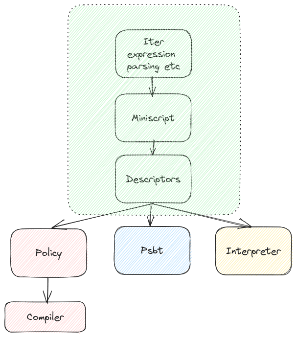

## Miniscript High level design

As of 10.0.0 rust-miniscript is roughly divided into following components:

* **Miniscript Core**(Green box): This is the core of the library. It contains the core data structures and algorithms for miniscript and output descriptors.
All the users are expected to interact with the library using the descriptor APIs. Raw miniscript should be used only if you know what you are doing.
* **Policy**(Red box): This module consists of _two_ separate policy languages with different purposes:
    - _Concrete Policy_: Concrete policy is a simple language which allows users to specify the policy for a descriptor. The miniscript compiler compiles this concrete policy into a descriptor.
    - _Semantic Policy_: The policy module also provides a "semantic policy" for analysis of descriptors and miniscript. Unlike the concrete policy, which is implemented and used by other projects, the semantic policy is purely part of rust-miniscript. The APIs on this object can be used to analyze descriptors and miniscripts for various properties.

* **Psbt**(Blue box): Psbt support for descriptors. Provides several new extension APIs to interact for miniscript descriptors in a psbt including finalizer, planning, signing, descriptor updates, etc.
* **Interpreter**(Yellow box): Script Interpreter for miniscript. It also provides APIs to figure out the satisfied constraints for a given transaction input. Useful for detecting which spend path the transaction output was spend with, as in the case of watchtowers or general monitoring, block explorers, etc.