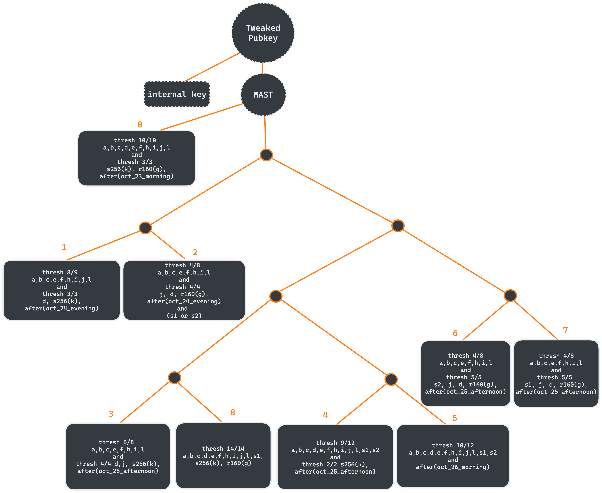

# Taptree of Horror Example

### Running this example:
- `cargo run --example taptree_of_horror --features "compiler"`

### Originally based on the TABConf 6, CTB.
The challenge can be found here:
- https://tabctb.com/six
- https://tabctb.com/six/thebeginning/thetree/grim/iacceptyourterms.html

### This example demonstrates:
- Providing multiple extended private key (xpriv) descriptors for sample personas.
- Creating a policy using logical 'and/or' conditions with preimages and signatures and timelocks.
- Structuring a Taproot tree (taptree) with an internal key into logical branches and leaves based on the policy.
- Implementing nine complex tapleaves within the taptree.
- Building a spending transaction that signs and satisfies one of the tapleaves using signatures, preimages and a timelock.

### Helpful Graphic to visualize using Excalidraw

